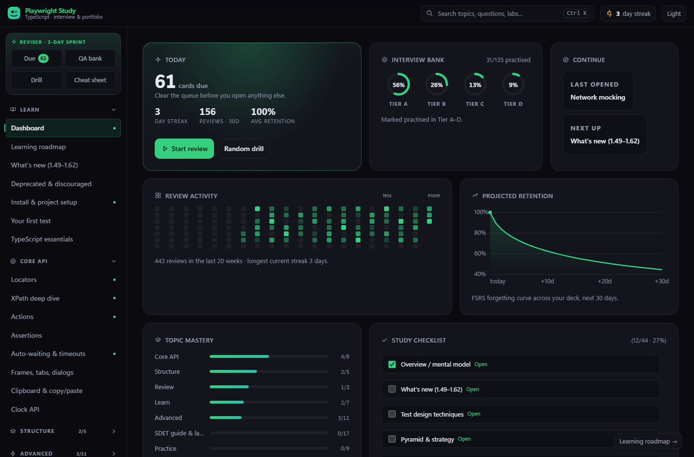
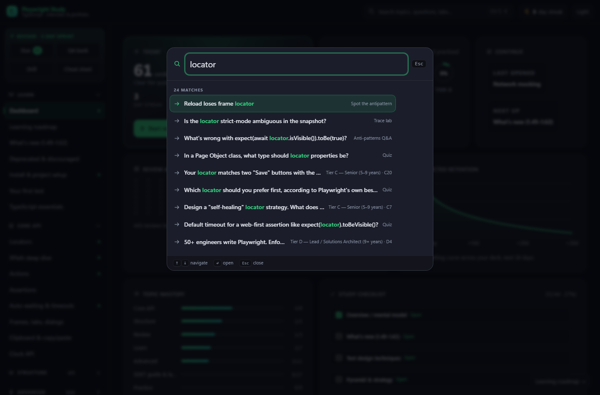
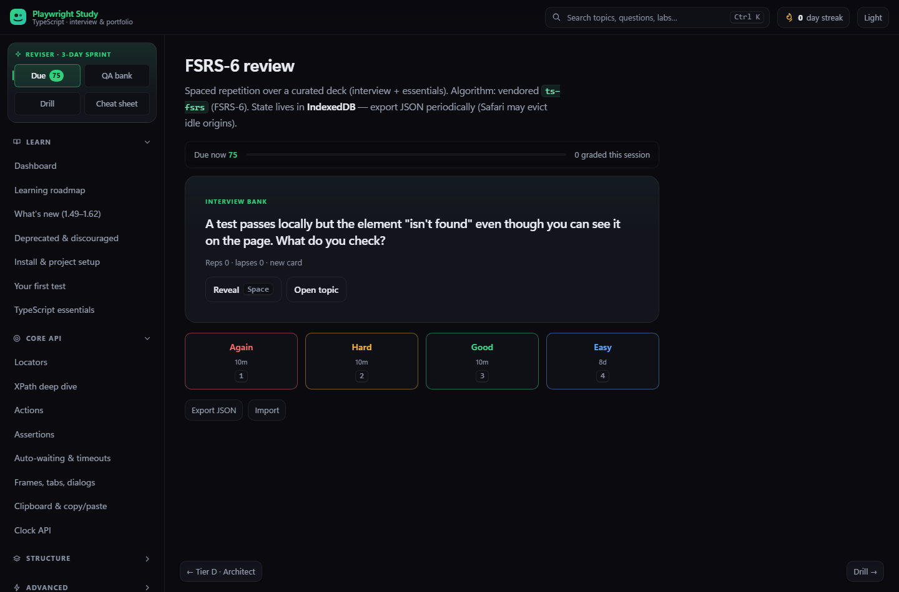
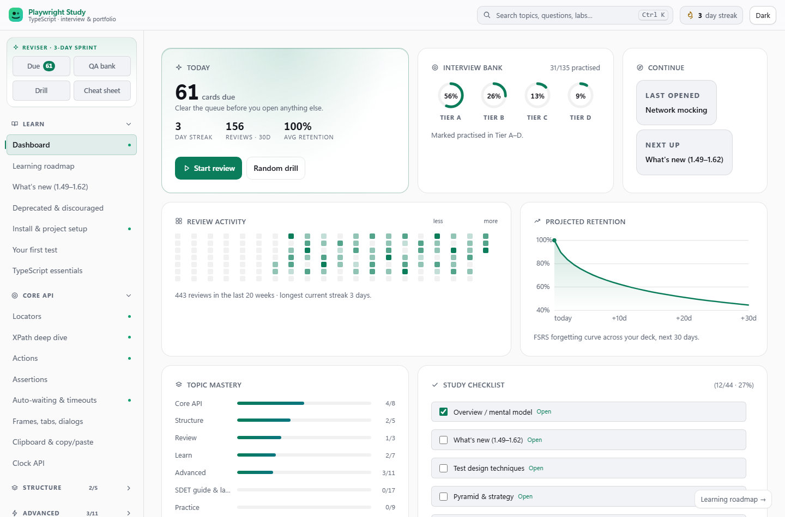

# Playwright QA Learning (all-in-one)

Owned by **[SatyamChouksey-88](https://github.com/SatyamChouksey-88)** — Playwright study site + practice suite + interview bank.

[](https://github.com/SatyamChouksey-88/playwright-qa-learning/actions/workflows/content-check.yml)
[](https://github.com/SatyamChouksey-88/playwright-qa-learning/actions/workflows/practice-suite.yml)



<details>
<summary>More screens — command palette, review, light theme</summary>

| | |
|---|---|
|  |  |
|  | |

</details>

| Folder | What it is |
|--------|------------|
| [`learning-site/`](./learning-site/) | Offline SPA — currency modules, Bank Demo, FSRS, MiniSearch (`file://` zero install) |
| [`practice-suite/`](./practice-suite/) | Playwright TS — **PR:** `@bank-demo` · **Nightly:** `@external` |
| [`interview-qa/`](./interview-qa/) | Markdown SSOT (tiers A–D + QA-75 + agentic D36–D40) |
| [`tools/content/`](./tools/content/) | Author-time generator |
| [`docs/adr/`](./docs/adr/) | ADRs (search, MD SSOT, bank-demo CI, PWA, FSRS, suite hardening, content expansion) |

Want to contribute? See [`CONTRIBUTING.md`](./CONTRIBUTING.md).

## Metrics (portfolio snapshot)

| Signal | Value |
|--------|-------|
| Interview scenarios | **135** (A25 + B34 + C32 + D44) |
| Framework Academy | **30** lessons · **66** MCQs · **10** exercises · **20** FW-S scenarios |
| Stuck hub entries | **60** |
| Production case studies | **10** |
| Interviewer Mode | **90** questions · **10** live coding · **8** kits · **8** craft |
| Essentials pack | ~53 |
| Deep-dive tracks | Production failures (14) · Framework-at-scale (6) · Internals (8) · Code review lab (10) · Debugging artifacts lab (8) · BDD mapping · CI deep dive · Contract & real-time |
| Search corpus | **907** MiniSearch docs |
| SDET guide & labs | **23** curated teaching pages (clarity-templated) |
| External practice specs | **47** `@external` (nightly, 46 files) |
| Bank-demo PR specs | auth + site smoke (`@bank-demo`) |
| Runtime install for site | **0** |
| Dashboard charts | 4 hand-rolled SVG (heatmap, rings, retention curve, mastery bars) |
| Framework diagrams | **8** theme-aware SVG (arch, fixtures, auth, config, CI, data, tree, decide) |
| Interviewer diagrams | **2** theme-aware SVG (round flow, scoring) |
| Skill Modules | **6** tracks · **47** lessons · **59** MCQs · **15** exercises |
| Mock exam pool | **155** MCQs (Skills + Framework + Quiz) |
| Readiness topics | **62** in topic registry |
| Contrast floor measured | **5.1:1** dark and light (AA body text) |

**Gamification note:** Quality-gated streaks, milestone badges, and client-side certificates are included. Leaderboards are deliberately excluded (require backend; learning science shows they discourage most learners).

**Readiness formula:** `TopicMastery = 0.5·EWMA accuracy + 0.3·mean FSRS R + 0.2·exercise completion` — see Readiness page for transparent breakdown.

## Quick start

### Learning site
```bash
start learning-site/index.html
```

### Author regenerate
```bash
npm install
npm run build:content
npm run check:content
```

### Practice suite
```bash
cd practice-suite
npm install
npx playwright install chromium
npm run test:bank-demo          # PR gate
npm run test:external           # nightly / hostile hosts
```

## CI / Pages

- PR: content check + bank-demo Chromium
- Nightly / `workflow_dispatch`: sharded `@external`
- Pages: workflow deploys `learning-site/` from `main`

**If the live demo 404s:** enable **Settings → Pages → Source: GitHub Actions**, then re-run “Deploy Pages” (or push a `learning-site/**` change). Until Pages is enabled, GitHub cannot publish and the `github.io` URL stays 404. Local forever works: open `learning-site/index.html` via `file://`.

Live (when enabled): https://satyamchouksey-88.github.io/playwright-qa-learning/learning-site/

## Governed AI note

Playwright Test Agents/MCP are taught as **scaffolding with review gates**. Healer skips change suite signal — humans own architecture (see `#agents-mcp`, D10/D36).

## License

MIT — see [`LICENSE`](./LICENSE).
